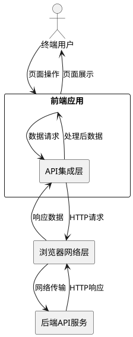
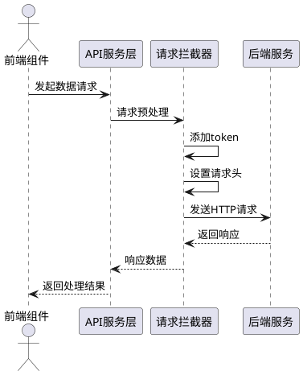
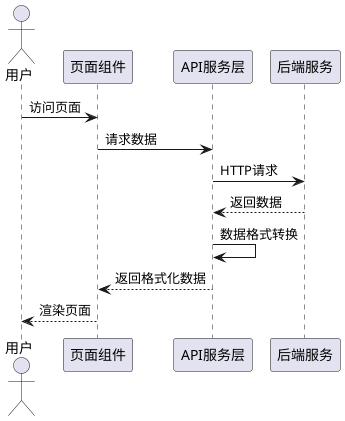
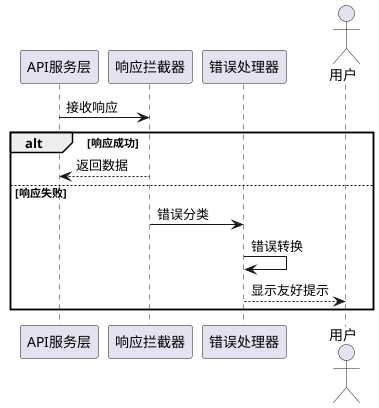

# **1. 组件定位**

## **1.1 核心职责**

本组件负责前端应用与后端API的数据交互，实现页面数据从模拟数据到真实后端数据的无缝切换。

## **1.2 核心输入**

1. **后端API响应数据**：来自后端服务的HTTP响应，包括文章列表、文章详情、用户信息等
2. **用户操作请求**：用户在页面上的交互操作触发的数据请求（如查看文章详情、筛选文章等）
3. **API配置信息**：后端API的基础URL、请求超时时间、认证token等配置参数

## **1.3 核心输出**

1. **页面渲染数据**：将后端返回的数据处理后提供给Vue组件进行页面渲染
2. **用户反馈信息**：请求成功/失败后的提示信息（如加载状态、错误提示）
3. **请求日志**：API请求和响应的日志记录，用于调试和监控

## **1.4 职责边界**

本组件**不负责**：
1. 后端API的具体实现逻辑
2. 数据库结构和数据存储方式
3. 页面UI的具体渲染逻辑（由Vue组件负责）
4. 业务数据的计算逻辑（如数据统计、格式转换等由后端负责）

# **2. 领域术语**

**API请求**
: 前端向后端服务发起的HTTP请求，用于获取或提交数据。

**API响应**
: 后端服务返回给前端的数据结果，包含状态码、数据内容和错误信息。

**请求拦截器**
: 在请求发送前对请求进行统一处理的函数，如添加认证token、设置请求头等。

**响应拦截器**
: 在响应返回后对响应进行统一处理的函数，如错误处理、数据格式转换等。

**Mock数据**
: 模拟的假数据，用于前端开发阶段模拟后端API返回的数据结构。

# **3. 角色与边界**

## **3.1 核心角色**

- **前端开发者**：负责配置API连接、处理数据交互逻辑
- **终端用户**：通过页面操作触发数据请求，查看后端返回的数据内容

## **3.2 外部系统**

- **后端API服务**：提供文章列表、文章详情、用户信息等RESTful API接口
- **浏览器网络层**：负责实际的HTTP请求发送和响应接收

## **3.3 交互上下文**

# **4. DFX约束**

## **4.1 性能**

1. API请求超时时间不得超过10秒
2. 页面首次加载时，首屏数据请求响应时间应小于2秒
3. 并发请求时，应支持至少5个同时进行的API请求

## **4.2 可靠性**

1. 当API请求失败时，系统应显示友好的错误提示，不应出现白屏或崩溃
2. 网络异常时，应提供重试机制，最多自动重试3次
3. API响应数据格式不符合预期时，应进行数据校验并给出明确错误提示

## **4.3 安全性**

1. 所有API请求必须支持HTTPS协议
2. 需要认证的接口必须在请求头中携带有效的认证token
3. 敏感数据（如token）不得在URL参数中传递
4. 请求和响应数据应进行必要的XSS防护

## **4.4 可维护性**

1. 所有API请求必须有清晰的日志记录，包括请求URL、参数、响应时间、状态码
2. API配置（如baseURL、timeout）应集中管理，便于环境切换
3. 错误处理逻辑应统一封装，避免在各组件中重复编写

## **4.5 兼容性**

1. 支持主流浏览器（Chrome、Firefox、Safari、Edge）的最新两个版本
2. API接口变更时，应保持向后兼容或提供版本迁移方案

# **5. 核心能力**

## **5.1 API请求配置**

### **5.1.1 业务规则**

1. **基础配置管理**：必须提供统一的API配置管理，包括baseURL、timeout、headers等基础参数
   a. 验收条件：[开发者设置API配置] → [所有API请求使用统一配置]

2. **环境切换支持**：应当支持开发、测试、生产环境的API地址配置切换
   a. 验收条件：[切换环境配置] → [API请求自动指向对应环境后端]

3. **请求拦截处理**：必须在请求发送前统一处理认证token、请求头等公共逻辑
   a. 验收条件：[发起API请求] → [请求头自动携带token和公共参数]

### **5.1.2 交互流程**

### **5.1.3 异常场景**

1. **网络连接失败**
   a. 触发条件：[用户网络断开或后端服务不可达]
   b. 系统行为：[捕获网络错误，记录错误日志]
   c. 用户感知：[显示"网络连接失败，请检查网络设置"提示]

2. **请求超时**
   a. 触发条件：[后端响应时间超过配置的timeout]
   b. 系统行为：[取消请求，记录超时日志]
   c. 用户感知：[显示"请求超时，请稍后重试"提示]

3. **认证失败**
   a. 触发条件：[token无效或已过期]
   b. 系统行为：[清除本地token，记录认证失败日志]
   c. 用户感知：[跳转到登录页面，提示"登录已过期，请重新登录"]

## **5.2 数据获取与展示**

### **5.2.1 业务规则**

1. **首页推荐文章列表获取**：必须支持从后端API `/api/articles/recommend` 获取推荐文章列表
   a. 验收条件：[用户打开网站首页] → [从后端获取推荐文章列表并渲染为信息流卡片]

2. **文章详情获取**：必须支持从后端API `/api/articles/detail` 根据文章ID获取文章详情
   a. 验收条件：[用户点击文章卡片] → [从后端获取文章详情并展示，包括Markdown内容渲染]

3. **用户侧写信息获取**：必须支持从后端API `/api/user/profile` 获取用户AI分析画像
   a. 验收条件：[用户进入个人中心] → [从后端获取用户AI侧写信息并展示技术雷达]

4. **AI摘要特殊展示**：必须为 `ai_summary` 字段提供特殊的UI样式（带AI闪光图标），彰显极客感
   a. 验收条件：[文章包含ai_summary字段] → [使用特殊样式展示AI摘要，区别于普通文本]

5. **Markdown内容渲染**：必须支持Markdown格式的文章内容渲染，包括代码块语法高亮
   a. 验收条件：[文章内容为Markdown格式] → [正确渲染Markdown，代码块支持Go/Python/Java等语言高亮]

6. **难度标签渲染**：必须根据 `difficulty` 字段（初级/中级/深度）渲染不同颜色的角标
   a. 验收条件：[文章包含difficulty字段] → [根据难度级别显示对应颜色的角标]

7. **交互状态同步**：必须根据 `interaction_status` 渲染点赞/收藏按钮的点亮状态
   a. 验收条件：[文章包含interaction_status] → [按钮状态与后端返回的is_liked/is_collected一致]

### **5.2.2 交互流程**

### **5.2.3 异常场景**

1. **数据格式不匹配**
   a. 触发条件：[后端返回的数据结构与前端预期不符]
   b. 系统行为：[进行数据校验，记录错误日志，使用默认值填充]
   c. 用户感知：[显示"数据加载异常"提示，部分数据可能显示为默认值]

2. **空数据处理**
   a. 触发条件：[后端返回空数据或null]
   b. 系统行为：[显示空状态提示]
   c. 用户感知：[显示"暂无数据"的空状态页面]

3. **数据加载失败**
   a. 触发条件：[API请求返回错误状态码（4xx、5xx）]
   b. 系统行为：[记录错误信息，显示错误提示]
   c. 用户感知：[显示"数据加载失败，请稍后重试"提示]

## **5.3 错误处理与反馈**

### **5.3.1 业务规则**

1. **统一错误处理**：必须对所有API错误进行统一捕获和处理
   a. 验收条件：[API请求发生错误] → [统一错误处理逻辑被触发]

2. **错误分类处理**：应当根据错误类型（网络错误、业务错误、认证错误）进行分类处理
   a. 验收条件：[发生特定类型错误] → [执行对应的错误处理逻辑]

3. **用户友好提示**：必须将技术性错误转换为用户可理解的提示信息
   a. 验收条件：[发生错误] → [用户看到友好的错误提示而非技术错误信息]

### **5.3.2 交互流程**

### **5.3.3 异常场景**

1. **未知错误类型**
   a. 触发条件：[收到无法识别的错误类型]
   b. 系统行为：[记录原始错误信息，使用通用错误提示]
   c. 用户感知：[显示"系统异常，请稍后重试"提示]

2. **错误提示失败**
   a. 触发条件：[错误提示组件初始化失败]
   b. 系统行为：[降级使用浏览器原生alert]
   c. 用户感知：[看到浏览器弹窗提示]

# **6. 数据约束**

## **6.1 API配置对象**

1. **baseURL**：后端API的基础地址，必须为有效的URL字符串，支持HTTP/HTTPS协议
2. **timeout**：请求超时时间，单位为毫秒，取值范围为1000-30000，默认值为10000
3. **headers**：公共请求头对象，必须包含Content-Type字段，可选包含Authorization字段

## **6.2 API响应对象**

1. **code**：响应状态码，必须为数字类型，200表示成功，4xx表示客户端错误，5xx表示服务端错误
2. **data**：响应数据内容，成功时为业务数据对象或数组，失败时可为null
3. **message**：响应消息，成功时为"success"或具体成功消息，失败时为错误描述信息

## **6.3 首页推荐文章列表响应**

**API路径**：`/api/articles/recommend`

**响应结构**：
1. **code**：响应状态码，200表示成功
2. **msg**：响应消息，"success"表示成功
3. **data.article_list**：文章列表数组

**文章列表项字段**：
1. **article_id**：文章唯一标识，字符串类型（如"wx_9527"），不可为空
2. **title**：文章标题，字符串类型，长度不超过200字符
3. **author**：作者名称，字符串类型
4. **publish_time**：发布时间，ISO 8601格式字符串（如"2026-04-18T10:00:00Z"）
5. **category**：文章分类，字符串类型（如"后端"、"前端"）
6. **ai_summary**：AI生成的精华摘要，字符串类型，需特殊UI样式展示
7. **tags**：技术标签数组，每个元素为字符串（如["Go", "并发编程"]）
8. **difficulty**：文章难度，枚举值："初级"、"中级"、"深度"
9. **view_count**：浏览次数，数字类型
10. **is_collected**：是否已收藏，布尔类型

## **6.4 文章详情响应**

**API路径**：`/api/articles/detail`

**响应结构**：
1. **code**：响应状态码，200表示成功
2. **msg**：响应消息
3. **data**：文章详情对象

**文章详情字段**：
1. **article_id**：文章唯一标识，字符串类型
2. **title**：文章标题，字符串类型
3. **author**：作者名称，字符串类型
4. **publish_time**：发布时间，ISO 8601格式字符串
5. **category**：文章分类，字符串类型
6. **ai_summary**：AI生成的精华摘要，字符串类型
7. **tags**：技术标签数组
8. **content**：文章正文，Markdown格式字符串，需使用Markdown渲染器展示
9. **metrics**：文章指标对象
   - **view_count**：浏览次数
   - **like_count**：点赞次数
   - **collect_count**：收藏次数
10. **interaction_status**：用户交互状态对象
    - **is_liked**：是否已点赞，布尔类型
    - **is_collected**：是否已收藏，布尔类型
11. **original_url**：原文链接，微信公众号URL，必须在文末提供"阅读原文"按钮

## **6.5 用户侧写响应**

**API路径**：`/api/user/profile`

**响应结构**：
1. **code**：响应状态码，200表示成功
2. **msg**：响应消息
3. **data**：用户侧写对象

**用户侧写字段**：
1. **user_id**：用户唯一标识，字符串类型
2. **nickname**：用户昵称，字符串类型
3. **avatar_url**：用户头像URL，字符串类型
4. **ai_analysis**：AI分析对象
   - **ai_profile_summary**：AI生成的用户专属评语，字符串类型，需酷炫卡片展示
   - **technical_level**：技术等级，字符串类型（如"资深探索者"）
   - **core_interests**：核心技术栈数组，每个元素包含：
     - **name**：技术名称（如"Go"）
     - **weight**：权重值，数字类型，范围0-100

## **6.6 重要提示**

⚠️ **后端警告**：AI计算的vector（768维数组）仅供后端存Redis做推荐用，**绝对不要下发给前端**，会导致浏览器卡死。
